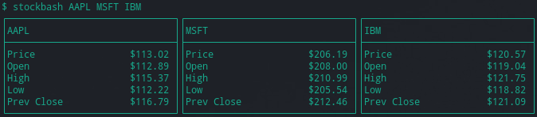

## StockBash
---

This is a simple bash script to print formatted global stock quotes out to the terminal.


#### Requirements
---
- [Alphavantage API Key](https://www.alphavantage.co/support/#api-key)
    - *note: Requests are rate limited. Free tier allows 5 requests per minute, 500 per day.
    - *note: Each stock is counted as a single request.
    
- Linux/macOS Bash

    
#### Usage
---

To use add your ```API Key``` to the environment and pass stock symbols into the script as arguments.

